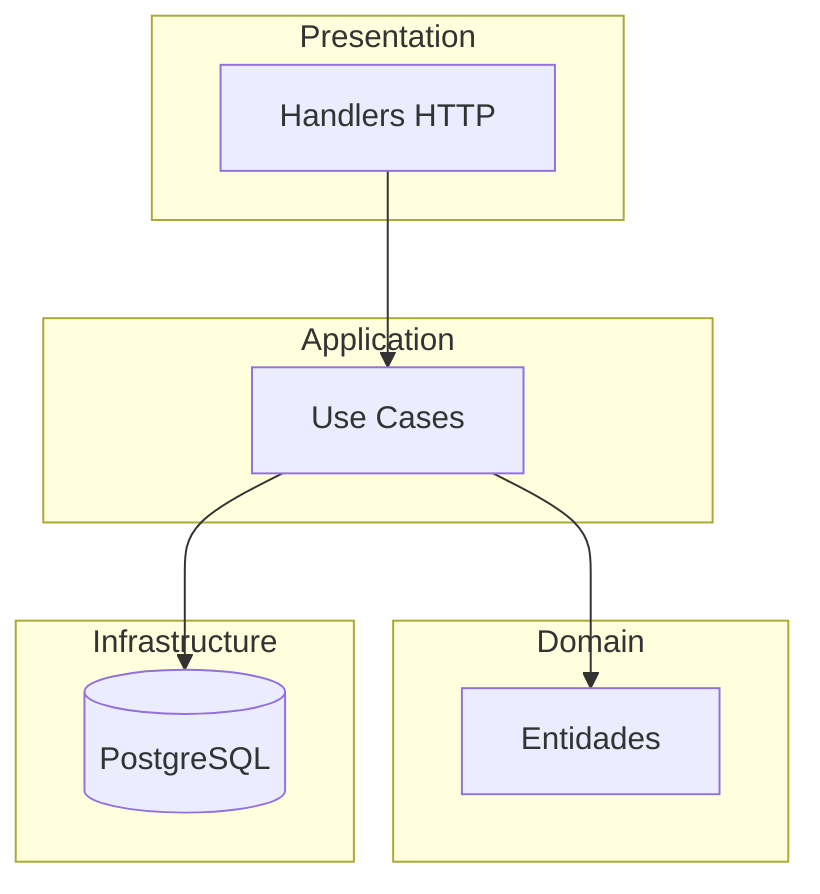
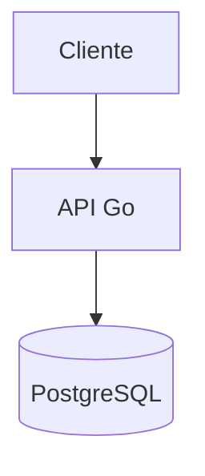

# Arquitectura de la Aplicación

Esta sección describe los componentes principales y el despliegue de la solución.

## Modelo de Componentes

## Modelo de Despliegue

Los diagramas están construidos con **Mermaid** para facilitar su actualización y lectura.
