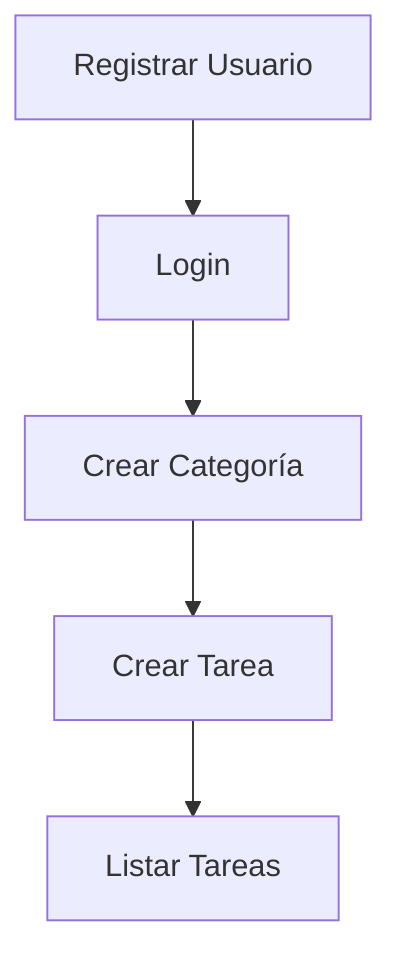

# Endpoints y Flujo

La siguiente tabla resume los principales endpoints expuestos por la API:

| Método | Ruta                | Descripción                  |
|--------|--------------------|------------------------------|
| POST   | `/api/v1/register` | Registro de usuario          |
| POST   | `/api/v1/login`    | Autenticación y obtención JWT|
| GET    | `/api/v1/tasks`    | Listar tareas del usuario    |
| POST   | `/api/v1/tasks`    | Crear nueva tarea            |

Los detalles completos de cada servicio se encuentran en el archivo [`openapi.yaml`](../openapi.yaml).

## Flujo de Uso

